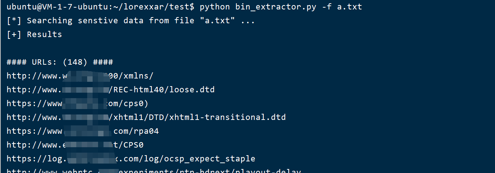

# Minitools-bin_extractor

ps: Please run the script in python2.7/python3 environment.


一个简单的用于快速挖掘二进制文件中敏感信息的脚本。

```
$ python bin_extractor.py -h
Usage: bin_extractor.py [options]

Options:
  --version             show program's version number and exit
  -h, --help            show this help message and exit
  -f FILENAME, --file=FILENAME
                        strings dump file
  -s SCHEME, --scheme=SCHEME
                        url scheme http or https, default(http)
  -d DOMAIN, --domain=DOMAIN
                        url domain
  -p PORT, --port=PORT  url port
  -t TIMEOUT, --timeout=TIMEOUT
                        url verify timeout
  -v, --verify          url path verify

```


## Usage

建议配合strings使用，效果更好。

```
strings * > /tmp/data.txt
python bin_extractor.py -f /tmp/data.txt -s https -d 10.10.0.106 -p 10443 -v
```

一个简单的范例图片

